<p align="center">
  
</p>

<h1 align="center">Гравитация нас не удержит</h1>

<p align="center">
  <strong>Фитнес-центр для тех, кто хочет покорить силу тяжести</strong>
</p>

<p align="center">
  <a href="#-о-проекте">О проекте</a> •
  <a href="#-скриншоты">Скриншоты</a> •
  <a href="#-технологии">Технологии</a> •
  <a href="#-тестирование">Тестирование</a> •
  <a href="#-запуск">Запуск</a> •
  <a href="#-автор">Автор</a>
</p>

<p align="center">
  <!-- Основной стек -->
  <picture>
    
  </picture>
  &nbsp;&nbsp;
  <picture>
    
  </picture>
  &nbsp;&nbsp;
  <picture>
    
  </picture>
  &nbsp;&nbsp;
  <picture>
    
  </picture>
  &nbsp;&nbsp;
  <picture>
    
  </picture>
  &nbsp;&nbsp;
  <picture>
    
  </picture>
  &nbsp;&nbsp;
  <picture>
    
  </picture>
</p>

<p align="center">
  <!-- Тестирование -->
  <picture>
    
  </picture>
  &nbsp;&nbsp;
  <picture>
    
  </picture>
  &nbsp;&nbsp;
  <picture>
    
  </picture>
  &nbsp;&nbsp;
  <!-- Фронтенд -->
  <picture>
    
  </picture>
  &nbsp;&nbsp;
  <picture>
    
  </picture>
  &nbsp;&nbsp;
  <picture>
    
  </picture>
  &nbsp;&nbsp;
  <!-- IDE -->
  <picture>
    
  </picture>
</p>

<p align="center">
  <!-- Дополнительные технологии -->
  <picture>
    
  </picture>
  &nbsp;&nbsp;
  <picture>
    
  </picture>
  &nbsp;&nbsp;
  <picture>
    
  </picture>
  &nbsp;&nbsp;
  <picture>
    
  </picture>
</p>

---

## 📖 О проекте

Здесь мы учим не просто качать мышцы — **мы учим летать** (ну, почти). Горизонт, флажок, стойка на руках, планш и куча других элементов, которые заставят твоих друзей смотреть на тебя с открытым ртом.

### Что умеет сайт

| Страница | Описание |
|----------|----------|
| **Главная** | Информация о фитнес-центре, преимуществах и программах обучения |
| **Каталог элементов** | Список всех элементов с изображениями и кратким описанием |
| **Детальная страница** | Подробная информация о технике выполнения каждого элемента |
| **О нас** | История центра, философия и подход к тренировкам |
| **Контакты** | Форма обратной связи для записи на тренировки |

### Изучаемые элементы

- **Стойка на руках** — основа всех элементов
- **Отжимания в стойке** — сила и баланс
- **Горизонт ноги врозь** — первый шаг к планшу
- **Горизонт ноги вместе** — full planche
- **Спичаг** — плавный выход в стойку

---

## 📸 Скриншоты

### Главная страница

<p align="center">
  
</p>

### Каталог элементов

<p align="center">
  
</p>

### Детальная страница элемента

<p align="center">
  
</p>

### Страница контактов

<table>
  <tr>
    <td align="center">
      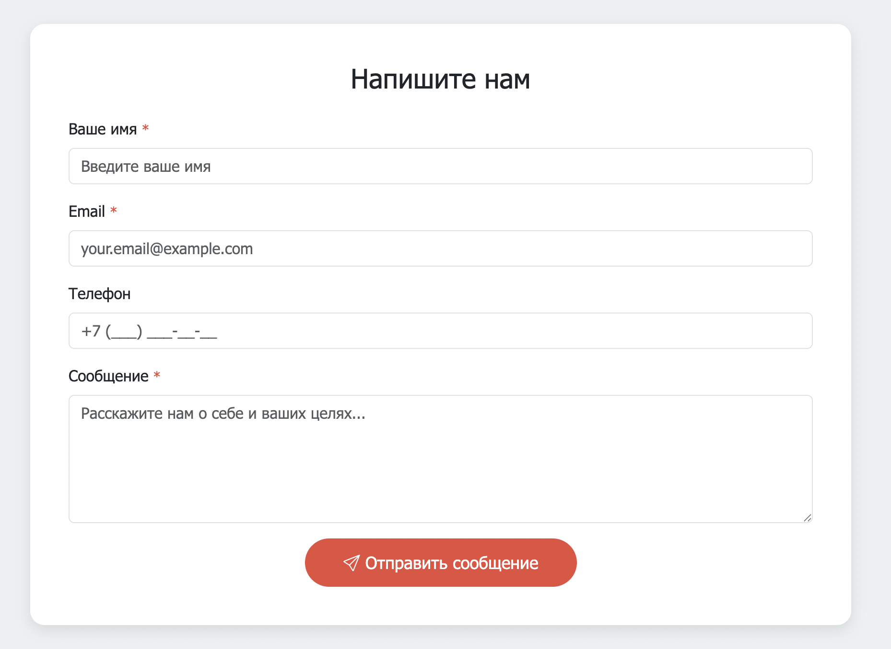
      <br><sub>Форма обратной связи</sub>
    </td>
    <td align="center">
      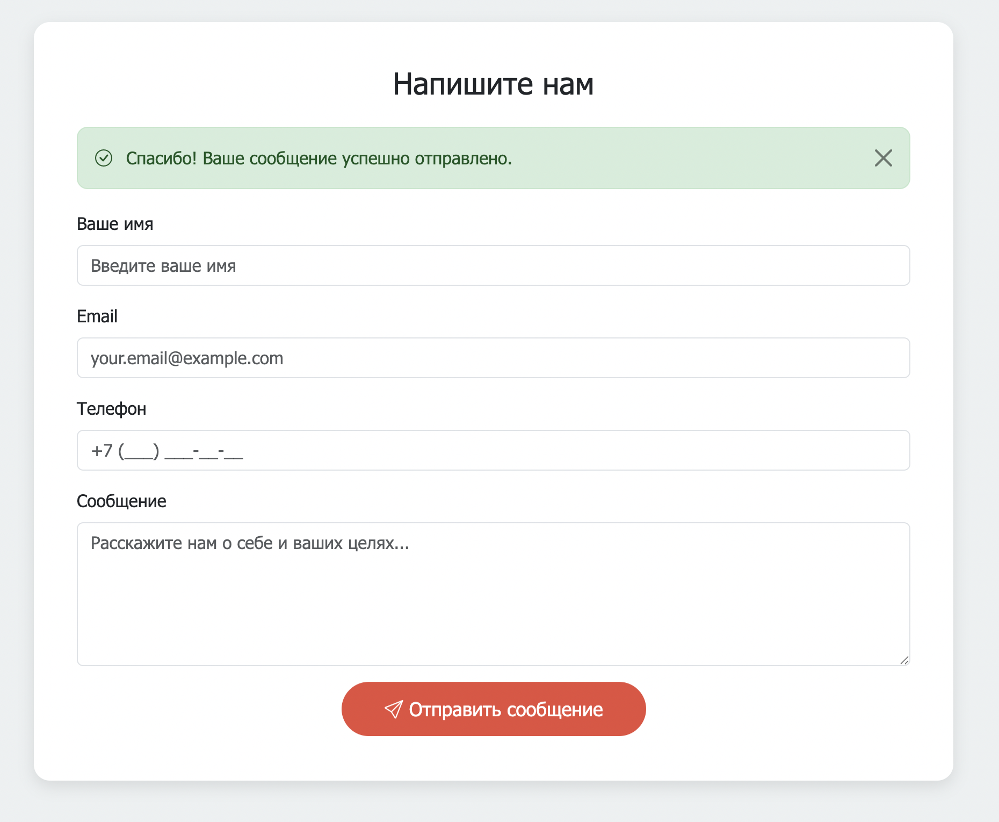
      <br><sub>Успешная отправка</sub>
    </td>
  </tr>
</table>

<table>
  <tr>
    <td align="center">
      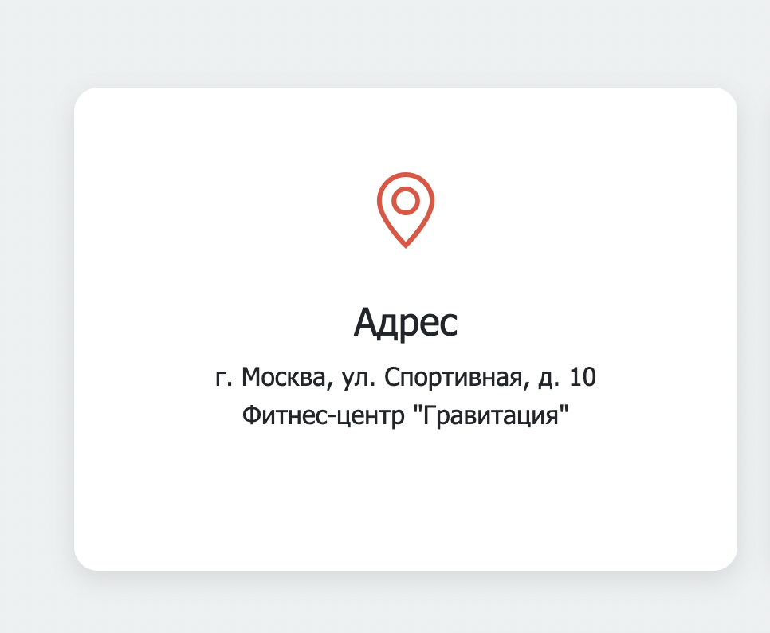
      <br><sub>Карточка адреса</sub>
    </td>
    <td align="center">
      
      <br><sub>Яндекс Карта</sub>
    </td>
  </tr>
</table>

---

## 🛠 Технологии

### Backend

| Технология | Версия | Назначение |
|------------|--------|------------|
| **Java** | 17 | Основной язык разработки |
| **Spring Boot** | 3.2.0 | Фреймворк для создания приложения |
| **Spring MVC** | — | Обработка HTTP запросов |
| **Spring Data JPA** | — | Работа с базой данных |
| **Hibernate** | — | ORM для маппинга сущностей |
| **Thymeleaf** | — | Шаблонизатор для HTML страниц |
| **PostgreSQL** | 16 | Основная база данных |
| **Lombok** | — | Сокращение boilerplate кода |

### Тестирование

| Технология | Версия | Назначение |
|------------|--------|------------|
| **JUnit 5** | — | Фреймворк для модульных тестов |
| **Selenide** | 7.9.2 | UI автотесты |
| **Allure** | 2.25 | Генерация отчётов |
| **H2** | — | In-memory БД для тестов |
| **RestTemplate** | — | API тесты |

### Инфраструктура

| Технология | Назначение |
|------------|------------|
| **Gradle** | Сборка проекта |
| **Docker** | Контейнеризация PostgreSQL |

---

## 🧪 Тестирование

Проект содержит **три уровня тестирования**:

### Пирамида тестов

```
         ╔══════════════════════════╗
         ║      UI тесты (Selenide) ║  ← E2E через браузер
         ╠══════════════════════════╣
         ║     API тесты (REST)     ║  ← HTTP запросы к эндпоинтам
         ╠══════════════════════════╣
         ║   DB тесты (Repository)  ║  ← Проверка слоя данных
         ╚══════════════════════════╝
```

### Структура тестов

```
src/test/java/com/fitness/
├── tests/
│   ├── ui/                    # UI тесты
│   │   ├── mainPage/
│   │   ├── aboutPage/
│   │   ├── contactsPage/
│   │   └── exerciseDetailPage/
│   ├── api/                   # API тесты
│   │   ├── exercise/
│   │   ├── contactMessage/
│   │   └── steps/
│   └── db/                    # DB тесты
│       ├── exercise/
│       ├── contactMessage/
│       └── steps/
├── steps/                     # UI шаги
├── module/                    # Page Objects
├── locators/                  # Локаторы (YAML + Java)
└── config/                    # Конфигурации
```

### Allure Report

<p align="center">
  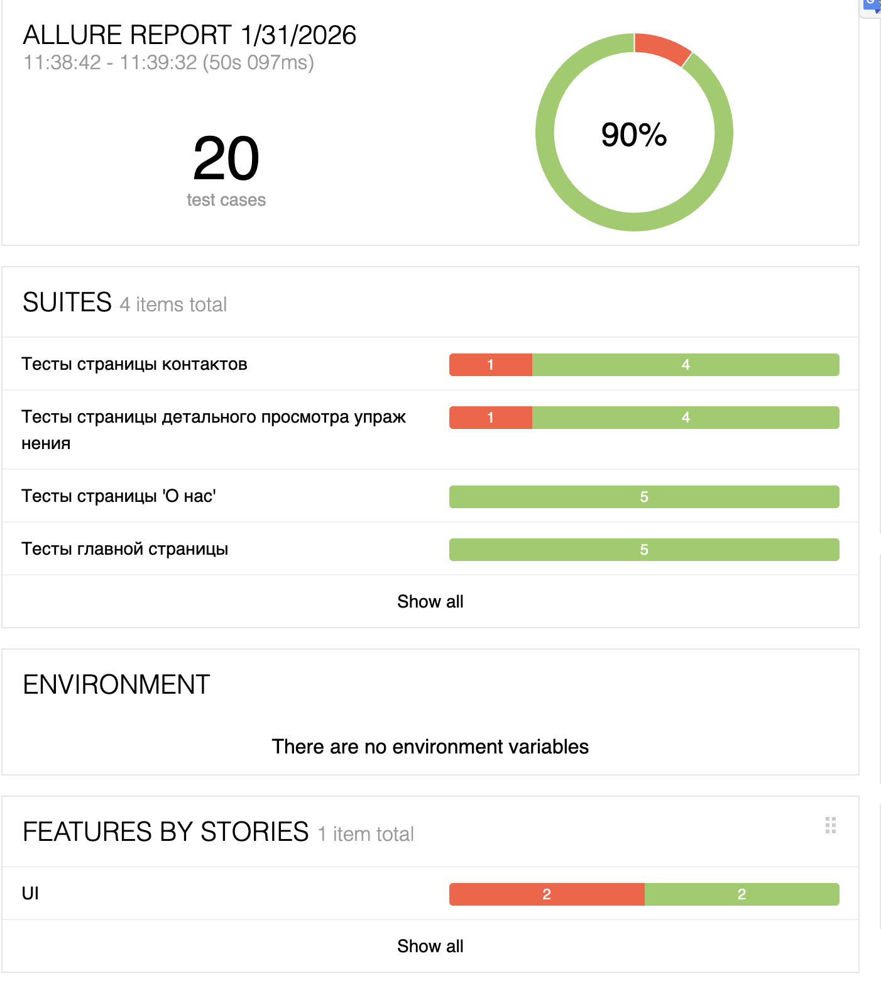
</p>

<details>
<summary><b>Тестовые сьюты с детализацией</b></summary>
<p align="center">
  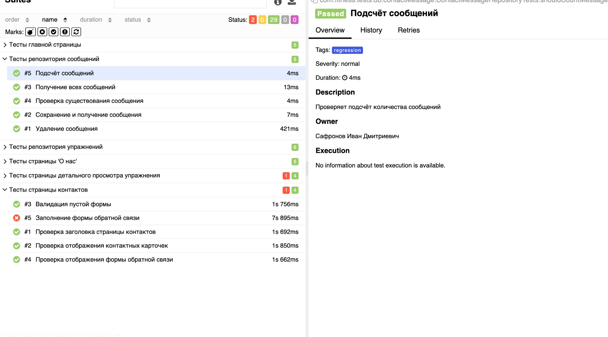
</p>
</details>

<details>
<summary><b>UI тесты с детализацией шагов</b></summary>
<p align="center">
  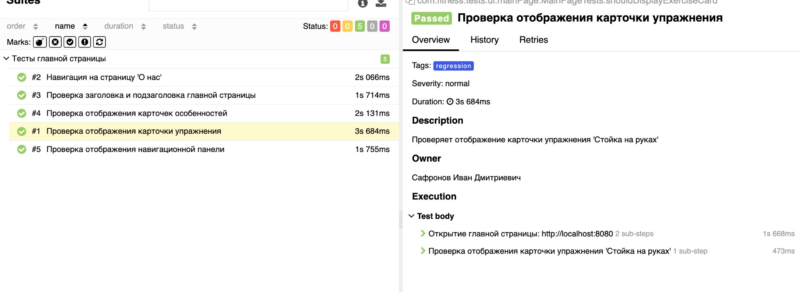
</p>
</details>

<details>
<summary><b>API тесты</b></summary>
<p align="center">
  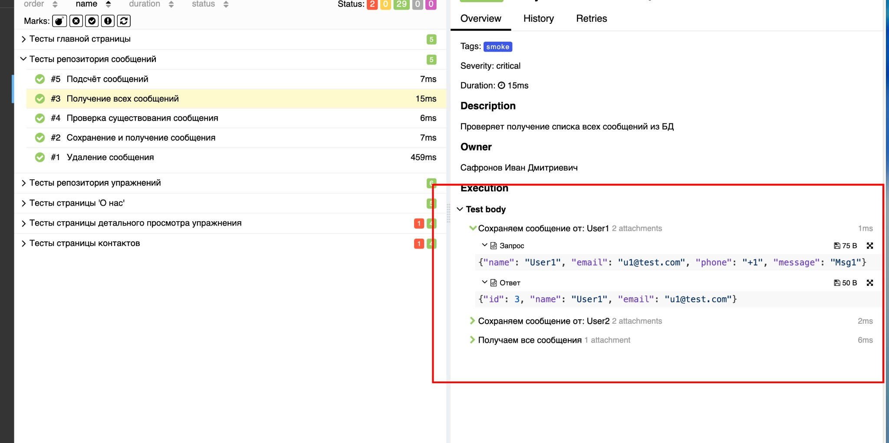
</p>
</details>

<details>
<summary><b>Видео-вложения</b></summary>
<p align="center">
  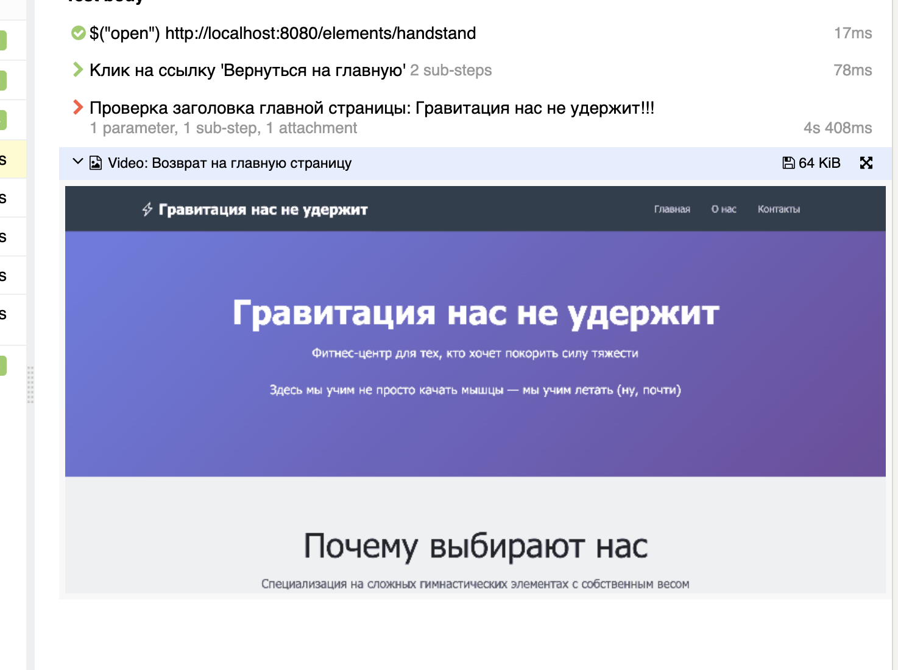
</p>
</details>

<details>
<summary><b>Категории дефектов</b></summary>
<p align="center">
  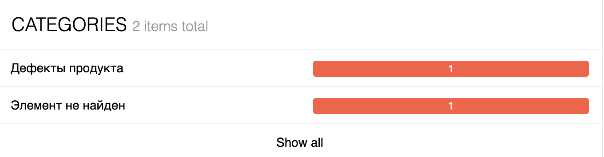
</p>
</details>

### Запуск тестов

```bash
# Все тесты
./gradlew clean test

# Только UI тесты
./gradlew test --tests "com.fitness.tests.ui.*"

# Только API тесты
./gradlew test --tests "com.fitness.tests.api.*"

# Только DB тесты
./gradlew test --tests "com.fitness.tests.db.*"

# Генерация Allure отчёта
./gradlew allureServe
```

---

## 🚀 Запуск

### Требования

- Java 17+
- Gradle 8+
- Docker & Docker Compose
- Git

### Быстрый старт

```bash
# 1. Клонировать репозиторий
git clone <url-репозитория>
cd fitness_center

# 2. Запустить PostgreSQL
docker-compose up -d

# 3. Собрать и запустить приложение
./gradlew bootRun

# 4. Открыть в браузере
open http://localhost:8080
```

### Docker Compose

```yaml
services:
  postgres:
    image: postgres:16-alpine
    environment:
      POSTGRES_DB: fitness_db
      POSTGRES_USER: fitness
      POSTGRES_PASSWORD: fitness
    ports:
      - "5432:5432"
```

### Переменные окружения

| Переменная | Значение по умолчанию | Описание |
|------------|----------------------|----------|
| `SPRING_DATASOURCE_URL` | `jdbc:postgresql://localhost:5432/fitness_db` | URL базы данных |
| `SPRING_DATASOURCE_USERNAME` | `fitness` | Пользователь БД |
| `SPRING_DATASOURCE_PASSWORD` | `fitness` | Пароль БД |

---

## 📁 Структура проекта

```
fitness_center/
├── src/
│   ├── main/
│   │   ├── java/com/fitness/
│   │   │   ├── controller/      # REST и Web контроллеры
│   │   │   ├── entity/          # JPA сущности
│   │   │   ├── repository/      # Spring Data репозитории
│   │   │   └── config/          # Конфигурации
│   │   └── resources/
│   │       ├── templates/       # Thymeleaf шаблоны
│   │       ├── static/          # Статика (CSS, JS, images)
│   │       └── application.properties
│   └── test/                    # Тесты
├── docs/images/                 # Скриншоты для README
├── build.gradle                 # Зависимости
├── docker-compose.yml           # PostgreSQL контейнер
└── README.md
```

### IDE

<details>
<summary><b>Структура проекта в IntelliJ IDEA</b></summary>
<p align="center">
  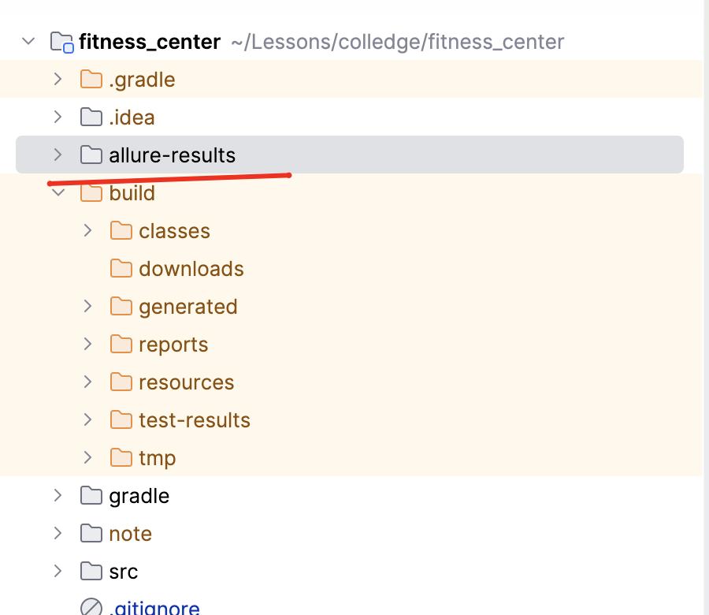
</p>
</details>

<details>
<summary><b>Конфигурация приложения</b></summary>
<p align="center">
  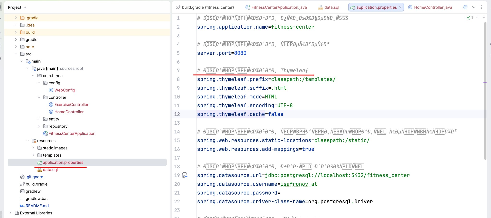
</p>
</details>

<details>
<summary><b>База данных PostgreSQL</b></summary>
<p align="center">
  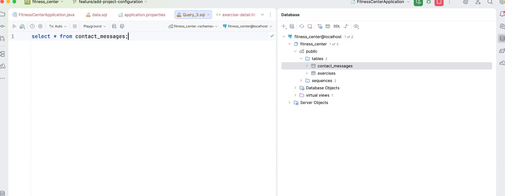
</p>
</details>

---

## 🔭 Roadmap

- [ ] Мобильное приложение (iOS/Android)
- [ ] Видео-уроки по технике выполнения
- [ ] Личный кабинет пользователя
- [ ] Онлайн-запись на тренировки
- [ ] Система достижений и прогресса
- [ ] Чат с тренерами

---

## 👤 Автор

<table>
  <tr>
    <td align="center">
      <b>Сафронов Иван Дмитриевич</b><br>
      <sub>Full-stack Developer & QA Engineer</sub>
    </td>
  </tr>
</table>

---

## 📄 Лицензия

Проект создан в образовательных целях и является открытым.

---

<p align="center">
  <i>Гравитация — это не приговор, это просто вызов. А мы поможем его принять.</i> 💪
</p>
